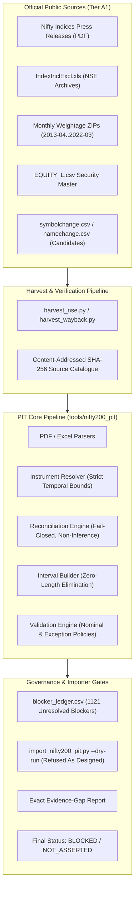

# Implementation Plan: NIFTY-200 PIT Evidence Resolution & Forensic Gap Audit

## Architecture & Data Flow

## Proposed Changes & Analysis

### 1. Forensic Probing & Evidence Verification
- Audit all missing checkpoints:
  - 2012-01-02 Initial Anchor: Verify whether an official first-party constituent file exists.
  - 2012-01 through 2013-03 (15 months): Verify whether Nifty Indices historical archive hosts weightage files.
  - 2022-04 through 2026-08 (53 months): Inspect downloaded official monthly ZIPs to verify publisher omissions.
- Audit 1,050 identity-lacking event rows in `IndexInclExcl.xls`:
  - Verify that observations supply company name only, lacking durable ISIN and publication causality.
  - Enforce rules 4-10: no promotion of B1, no name-to-ISIN guessing, no fuzzy matching, keep `MANUAL_REVIEW`.

### 2. Comprehensive Evidence-Gap Reporting
- Generate comprehensive gap report in `reports/nifty200_pit_evidence_gap_report_20260918.md`.
- Group and enumerate all blocker categories:
  - `MISSING_INITIAL_ANCHOR` (2012-01-02)
  - `MONTHLY_SNAPSHOT_MISSING` (69 periods: 2012-01..2013-03 and 2022-04..2026-08)
  - `MISSING_DURABLE_IDENTITY` (1,050 event rows)
  - `OTHER` / `NO_CERTIFIABLE_EVENTS`
- For each category, document exact searches performed, URLs checked, insufficiency rationale, and exact artifact needed for closure.

### 3. End-to-End Verification Pipeline
- Run full automated test suites:
  - `tests/test_nifty200_pit_*.py -vv` (62 tests)
  - `tests/test_storage*.py -vv` (9 tests)
- Static analysis & type checking:
  - `ruff check .`
  - `mypy ai_research/ tools/ data_platform/ storage/`
  - `pyright`
  - `compileall`
  - `git diff --check`
- Execute dry-run importer: verify `market_data.duckdb` is never modified.
